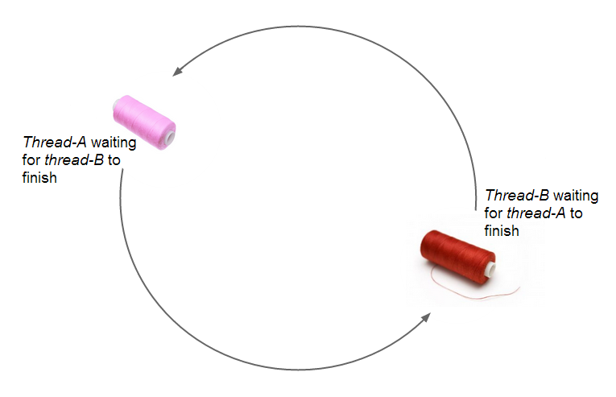
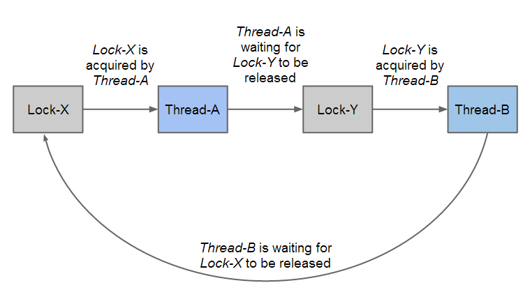
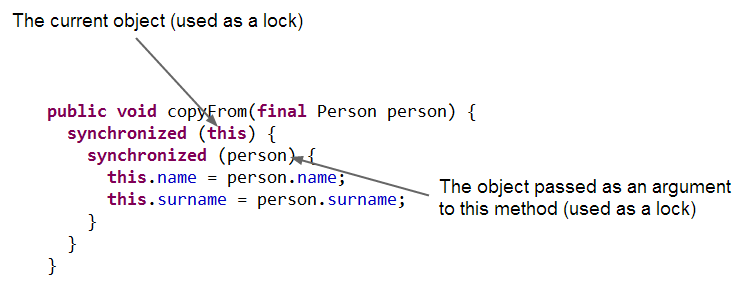
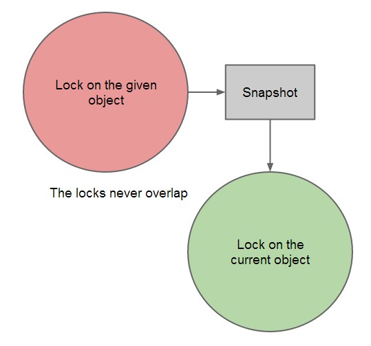
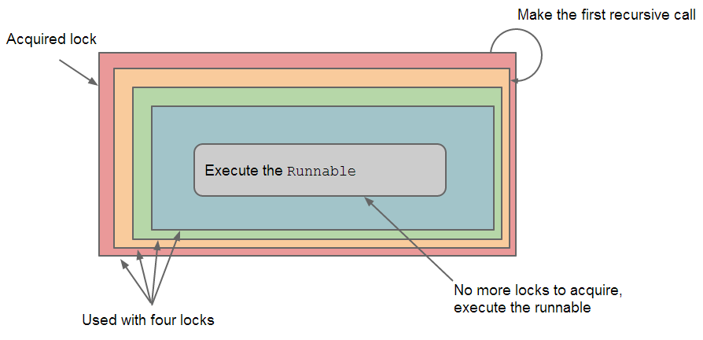
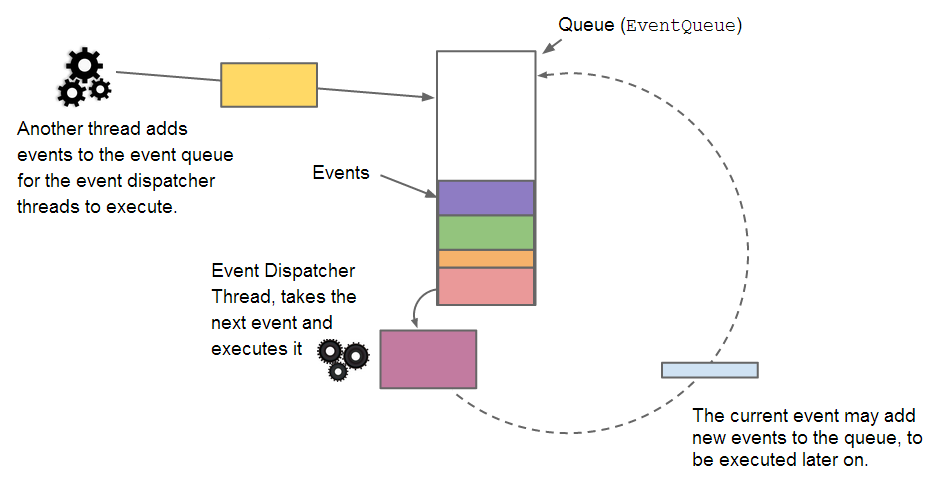

Imagine you are waiting for a call from your girlfriend with whom you had an argument.  She too is waiting for you to call her and apologise.  In other words, both of you are waiting for the other to call.  Now if no one takes the phone and calls the other, you will never talk again.  This is a deadlock and in this article we will see how deadlock occurs in programming and how to prevent it.  Unfortunately this article falls short in providing good tips about relationships.

The readers of this article are expected to have some background about threads as otherwise they may have difficulties to understand what is being discussed.  The readers are encouraged to read the article: [Understanding Threads Monitors and Locks](http://www.javacreed.com/understanding-threads-monitors-and-locks/) to get a good understanding about locks and how these are used by threads and their role in multithreading.

All code listed below is available at: [https://github.com/javacreed/what-is-deadlock-and-how-to-prevent-it](https://github.com/javacreed/what-is-deadlock-and-how-to-prevent-it).  Most of the examples will not contain the whole code and may omit fragments which are not relevant to the example being discussed. The readers can download or view all code from the above link.

## What is a Deadlock?

A deadlock is a state where two, or more, threads are blocked waiting ([Java Doc](http://docs.oracle.com/javase/7/docs/api/java/lang/Thread.State.html#BLOCKED)) for the other blocked waiting thread (or threads) to finish and thus none of the threads will ever complete.  For example, say we have two threads called _thread-A_ and _thread-B_.  These threads are in a deadlock state if _thread-A_ is waiting for _thread-B_ to finish, while _thread-B_ is waiting for _thread-A_ to finish as shown in the following image.  Once in deadlock state, both threads will hang forever.



The above image shows the two threads waiting on each other.  The description provided so far about deadlocks it is quite naive and tells us very little about them and what causes them.  Threads use resources, such as objects, and these resources may require that only one thread access them at a given point in time, otherwise we may get unexpected results.  Let's say we need to write a program that computes the average of the numbers found in a list similar to the one shown below.

```java
package com.javacreed.examples.deadlock.part1;

import java.util.ArrayList;
import java.util.List;

import com.javacreed.examples.deadlock.utils.ThreadUtils;

public class Example1 {

  public static double calculateAverage(final List<Integer> list) {
    double total = 0;
    for (int i = 0; i < list.size(); i++) {
      total += list.get(i);
    }

    return total / list.size();
  }

  /* The main() method was removed for brevity */
}
```

The method `calculateAverage()` takes a `List` ([Java Doc](http://docs.oracle.com/javase/7/docs/api/java/util/List.html)) of integers and computes their average.  The algorithm is very straightforward.  It first sums all numbers and saves this value in a variable called `total`.  Then divides this by the number of elements found in the list.

What happens if the list is modified (by another thread) while the `calculateAverage()` method is computing the average?  The result returned by the `calculateAverage()` may be incorrect.  It may cause the program to crash (throw an `IndexOutOfBoundsException` ([Java Doc](http://docs.oracle.com/javase/7/docs/api/java/lang/IndexOutOfBoundsException.html)) exception) if the last element is removed just before the `calculateAverage()` method retrieves it using the `get()` ([Java Doc](http://docs.oracle.com/javase/7/docs/api/java/util/List.html#get(int))) method.

Following is a list of events that can cause the `calculateAverage()` method to produce the wrong result.

1. A list with the following numbers is created.

    ```
    2, 4, 8 and 10
    ```

    The list declaration is shown next.

    ```java
        final List<Integer> list = new ArrayList<>();
        list.add(2);
        list.add(4);
        list.add(8);
        list.add(10);
    ```

1. A thread, named _thread-A_, is created.  This thread passes the list to the `calculateAverage()` method.

    ```java
        final Thread threadA = new Thread(new Runnable() {
          @Override
          public void run() {
            final double average = calculateAverage(list);
            ThreadUtils.log("Average: %.2f", average);
          }
        }, "Thread-A");
        threadA.start();
    ```

    The method `calculateAverage()` starts iterating the list and sums the first two numbers.  The variable `total` now reads `6`.

1. Another thread, named _thread-B_, is created.  This thread modifies the list and multiplies all entries by 2.

    ```java
        final Thread threadB = new Thread(new Runnable() {
          @Override
          public void run() {
            for (int i = 0; i < list.size(); i++) {
              list.set(i, list.get(i) * 2);
            }
          }
        }, "Thread-B");
        threadB.start();
    ```

    Thus the list now has the following values.

    ```
    4, 8, 16 and 20
    ```

1. _Thread-A_ finishes computing the average and sums the last two numbers.  Note that list was updated while _thread-A_ was in the process of computing the average.  Following is the list as observed by _thread-A_

    ```
    2, 4, 16 and 20
    ```

    The first two elements of the list have the value before this was updated by _thread-B_, while the last two elements of the list have the updated values.  When complete, _thread-A_ will print `10.5`, which is incorrect.  The average of the list should be either `6` (if computed before _thread-B_ is executed) or `12` (if computed after _thread-B_ is executed).

For this problem to manifest, the threads need to be executed in the order mentioned above.  Unfortunately, it is very hard to simulate this without using some timing control logic as shown next.

```java
package com.javacreed.examples.deadlock.part1;

import java.util.ArrayList;
import java.util.List;

import com.javacreed.examples.deadlock.utils.ThreadUtils;

public class Example1 {

  public static double calculateAverage(final List<Integer> list) {
    double total = 0;
    for (int i = 0; i < list.size(); i++) {
      total += list.get(i);
      /* This will cause the multithreading bug to manifest */
      ThreadUtils.silentSleep(1);
    }

    return total / list.size();
  }

  public static void main(final String[] args) throws Exception {
    final List<Integer> list = new ArrayList<>();
    list.add(2);
    list.add(4);
    list.add(8);
    list.add(10);

    final Thread threadA = new Thread(new Runnable() {
      @Override
      public void run() {
        final double average = Example1.calculateAverage(list);
        ThreadUtils.log("Average: %.2f", average);
      }
    }, "Thread-A");
    threadA.start();

    final Thread threadB = new Thread(new Runnable() {
      @Override
      public void run() {
        for (int i = 0; i < list.size(); i++) {
          list.set(i, list.get(i) * 2);
        }
      }
    }, "Thread-B");
    threadB.start();

    /* Wait for the threads to stop */
    threadA.join();
    threadB.join();
  }
}
```

The above program may produce different results every time it is executed.  The threads run independent from one another and their execution times and sequence may vary with every run.  This is another challenge when working with multiple threads, as it is very hard to understand and predict how these affect the other threads running in parallel with them.

This problem can be avoided if each thread obtains an exclusive lock on the list before it uses it.  **Given that all access to this list is guarded by the same lock**, then only one thread is allowed to access the list at a given point in time.  

```java
package com.javacreed.examples.deadlock.part1;

import java.util.ArrayList;
import java.util.List;

import com.javacreed.examples.deadlock.utils.ThreadUtils;

public class Example2 {

  public static void main(final String[] args) throws Exception {
    final List<Integer> list = new ArrayList<>();
    list.add(2);
    list.add(4);
    list.add(8);
    list.add(10);

    final Thread threadA = new Thread(new Runnable() {
      @Override
      public void run() {
        synchronized (list) {
          final double average = Example2.calculateAverage(list);
          ThreadUtils.log("Average: %.2f", average);
        }
      }
    }, "Thread-A");
    threadA.start();

    final Thread threadB = new Thread(new Runnable() {
      @Override
      public void run() {
        synchronized (list) {
          for (int i = 0; i < list.size(); i++) {
            list.set(i, list.get(i) * 2);
          }
        }
      }
    }, "Thread-B");
    threadB.start();

    /* Wait for the threads to stop */
    threadA.join();
    threadB.join();
  }

  /* The calculateAverage() method was removed for brevity */
}
```

In the above example, the same `list` object was used to guard the access to itself.  This is quite a common practice.  We can use any **non `null`** object to guard the list as shown below, but such approach is less popular.

```java
package com.javacreed.examples.deadlock.part1;

import java.util.ArrayList;
import java.util.List;

import com.javacreed.examples.deadlock.utils.ThreadUtils;

public class Example3 {

  public static void main(final String[] args) throws Exception {
    /* Used as a lock instead of the list itself */
    final Object lock = new Object();

    final List<Integer> list = new ArrayList<>();
    list.add(2);
    list.add(4);
    list.add(8);
    list.add(10);

    final Thread threadA = new Thread(new Runnable() {
      @Override
      public void run() {
        synchronized (lock) {
          final double average = Example3.calculateAverage(list);
          ThreadUtils.log("Average: %.2f", average);
        }
      }
    }, "Thread-A");
    threadA.start();

    final Thread threadB = new Thread(new Runnable() {
      @Override
      public void run() {
        synchronized (lock) {
          for (int i = 0; i < list.size(); i++) {
            list.set(i, list.get(i) * 2);
          }
        }
      }
    }, "Thread-B");
    threadB.start();

    /* Wait for the threads to stop */
    threadA.join();
    threadB.join();
  }

  /* The calculateAverage() method was removed for brevity */
}
```

The advantage of such approach is that the `list` can be `null` and we can guard more that one object if needs be with the same lock.

This solves our problem as _thread-B_ will have to wait for _thread-A_ to finish before it can manipulate the list (or the other way round, _thread-A_ will have to wait for _thread-B_ before computing the average).  Unfortunately locking of objects solves one problem but it can create another one.  The problem that locking introduces is called deadlock.

Following is a more precise definition of a deadlock.  A deadlock is a state where two, or more, threads are blocked waiting for the other blocked waiting thread (or threads) to **release a lock** thus none of the threads will ever complete.  Therefore, each thread needs to obtain more than one lock, and they only manage to obtain some of the locks (but not all of them).  For a deadlock to take place we need to have more than one thread and each of these threads needs to obtain more than one lock and the same locks are required by more than one thread.

Let say that _thread-A_ needs to obtains two locks, _lock-X_ and _lock-Y_.  It first acquires _lock-X_ and then acquires _lock-Y_.  When ready, _thread-A_ releases the locks in the reverse order these were acquired as shown next.

```java
package com.javacreed.examples.deadlock.part2;

import com.javacreed.examples.deadlock.utils.ThreadUtils;

public class Example1 {

  public static void main(final String[] args) throws Exception {
    final Object lockX = new Object();
    final Object lockY = new Object();

    final Thread threadA = new Thread(new Runnable() {
      @Override
      public void run() {
        ThreadUtils.log("Acquire lock-X");
        synchronized (lockX) {
          ThreadUtils.log("Acquire lock-Y");
          synchronized (lockY) {
            ThreadUtils.log("Both locks are acquired");
          }
          ThreadUtils.log("Release lock-Y");
        }
        ThreadUtils.log("Release lock-X");
      }
    }, "Thread-A");
    threadA.start();

    /* Wait for the thread to stop */
    threadA.join();
  }
}
```

The above program will produce the following

```
16:48:36 [Thread-A] Acquire lock-X
16:48:36 [Thread-A] Acquire lock-Y
16:48:36 [Thread-A] Both locks are acquired
16:48:36 [Thread-A] Release lock-Y
16:48:36 [Thread-A] Release lock-X
```

Note that all objects in Java can be used as locks.  Therefore any (non `null`) object can be used together with the `synchronize` block ([Tutorial](http://docs.oracle.com/javase/tutorial/essential/concurrency/locksync.html)) as a lock.  The `synchronize` block will automatically release the lock when complete.  This is also referred to as _intrinsic lock_ ([Tutorial](http://docs.oracle.com/javase/tutorial/essential/concurrency/locksync.html)).

_Thread-B_ too needs two locks and it tries to obtain them in the order shown next.

```java
package com.javacreed.examples.deadlock.part2;

import com.javacreed.examples.deadlock.utils.ThreadUtils;

public class Example2 {

  public static void main(final String[] args) throws Exception {
    final Object lockX = new Object();
    final Object lockY = new Object();

    final Thread threadA = new Thread(new Runnable() {
      @Override
      public void run() {
        ThreadUtils.log("Acquire lock-X");
        synchronized (lockX) {
          ThreadUtils.log("Acquire lock-Y");
          synchronized (lockY) {
            ThreadUtils.log("Both locks are acquired");
          }
          ThreadUtils.log("Release lock-Y");
        }
        ThreadUtils.log("Release lock-X");
      }
    }, "Thread-A");
    threadA.start();

    final Thread threadB = new Thread(new Runnable() {
      @Override
      public void run() {
        ThreadUtils.log("Acquire lock-Y");
        synchronized (lockY) {
          ThreadUtils.log("Acquire lock-X");
          synchronized (lockX) {
            ThreadUtils.log("Both locks are acquired");
          }
          ThreadUtils.log("Release lock-X");
        }
        ThreadUtils.log("Release lock-Y");
      }
    }, "Thread-B");
    threadB.start();

    /* Wait for the threads to stop */
    threadA.join();
    threadB.join();
  }
}
```

_Thread-B_ first tries to obtain _lock-Y_ and then _lock-X_.  This is the opposite (reverse) order used by _thread-A_.  There is a chance that this program experience a deadlock as described next.

1. _Thread-A_ starts and acquires _lock-X_.  At this point only _lock-X_ is acquired by _thread-A_.  _Lock-Y_ is still available for any thread to acquire it as shown in the following table.

    |Lock  |Acquired by|Waiting for|
    |------|-----------|-----------|
    |lock-X|thread-A   |           |
    |lock-Y|           |           |

1. _Thread-B_ starts and acquires _lock-B_.  

    |Lock  |Acquired by|Waiting for|
    |------|-----------|-----------|
    |lock-X|thread-A   |           |
    |lock-Y|thread-B   |           |

    Now both locks are now acquired by different threads as shown in the above table.  So far we do not have a problem.  _Thread-B_ tries to acquire _lock-A_, which is already acquired by _thread-A_.  Since this lock is acquired by another thread, _thread-B_ will have to wait until this lock is released.  Thus _thread-B_ is blocked waiting for _lock-X_ to be released.  In the meantime _thread-B_ still holds _lock-Y_.

    |Lock  |Acquired by|Waiting for|
    |------|-----------|-----------|
    |lock-X|thread-A   |thread-B   |
    |lock-Y|thread-B   |           |

    Again, so far we have no problem and we do not have a deadlock yet.  Note that _thread-A_ is not yet blocked as it has not yet attempt to acquire _lock-Y_.

1. _Thread-A_ tries to acquire _lock-Y_ which is already acquired by  _thread-B_.  Since this lock is acquired by another thread, _thread-A_ will have to wait until this lock is released.  Thus _thread-A_ is blocked waiting for _lock-Y_ to be released.  In the meantime _thread-A_ still holds _lock-X_ as shown in the following table.

    |Lock  |Acquired by|Waiting for|
    |------|-----------|-----------|
    |lock-X|thread-A   |thread-B   |
    |lock-Y|thread-B   |thread-A   |

    Now we have a deadlock.

At this stage both _thread-A_ and _thread-B_ are blocked waiting for the other thread to release their lock.  This causes a deadlock and once in this state, both threads will be blocked waiting forever.  



Unfortunately these threads cannot recover and the Java Virtual Machine (JVM) needs to be restarted.

## Preventing Deadlocks

The problem discussed before can be avoided by applying a suitable deadlock prevention technique.  Following are some techniques available that help mitigate the deadlock problem:

1. Non Overlapping Locks
1. Lock Ordering
1. Lock Timeout
1. Single Thread

There are other good techniques which are not listed here that can be used to mitigate deadlocks.  Each technique is discussed in more details next.  

Please note that not all techniques are applicable to all situations.  Some techniques will work better than others in specific circumstances and the reader needs to understand and select the right technique based on the situation at hand.

### Non Overlapping Locks

The problem described before occurred because a thread tried to acquire a lock while it was in possession of another lock.  In other words, the second lock was acquired while the thread was still holding the first lock.  Consider the following example.

```java
package com.javacreed.examples.deadlock.part3;

public class Person {

  private String name;
  private String surname;

  public void copyFrom(final Person person) {
    synchronized (this) {
      synchronized (person) {
        this.name = person.name;
        this.surname = person.surname;
      }
    }
  }

  /* Methods removed for brevity */
}
```

This example is identical to the example we discussed in the previous section, with _lock-X_ and _lock-Y_.  Here we have two objects of type `Person`, and these objects are used as locks as shown below.



This example is prone to deadlocks as we will see in the following example.

```java
package com.javacreed.examples.deadlock.part3;

public class Example1 {

  public static void main(String[] args) throws Exception {
    final Person personX = new Person("John", "Smith");
    final Person personY = new Person("John", "Smith");

    final Thread threadA = new Thread(new Runnable() {
      @Override
      public void run() {
        personX.copyFrom(personY);
      }
    }, "Thread-A");
    threadA.start();

    final Thread threadB = new Thread(new Runnable() {
      @Override
      public void run() {
        personY.copyFrom(personX);
      }
    }, "Thread-B");
    threadB.start();

    /* Wait for the threads to stop */
    threadA.join();
    threadB.join();
  }
}
```

_Thread-A_ is copying from `personY` to `personX` thus obtaining the locks in one order, while _thread-B_ is copying from `personX` to `personY` thus obtaining the locks in the opposite order.  This is quite common problem.

We can prevent deadlocks if we take a snapshot of the given object (similar to a memento ([Wiki](http://en.wikipedia.org/wiki/Memento_pattern))) and then use this snapshot to transfer the values from one object to the other.

```java
package com.javacreed.examples.deadlock.part3;

public class Person {

  private String name;
  private String surname;

  public void betterVersionOfCopyFrom(final Person person) {
    final String name;
    final String surname;

    /* Take a snapshot of the given object */
    synchronized (person) {
      name = person.name;
      surname = person.surname;
    }

    /* Copy the snapshot to this object */
    synchronized (this) {
      this.name = name;
      this.surname = surname;
    }
  }

  /* Methods removed for brevity */
}
```

Here we remove the lock overlapping, thus removed one of the requirements for deadlocks.  The thread executing this method, obtains one lock at a time.  First, copies the state of the given person object into local variables using one lock.  It then, uses these variables to transfer the state to the current object using another lock.



This approach mitigated deadlocks by removing lock overlapping.  Avoiding locks overlapping is a good practice but not always easy to achieve.  There are cases where we need to prevent any modifications to all objects while this thread is working on them.  In other words, both persons objects need to be locked before the operation can take place.  In this case other threads cannot access these objects until this thread is done.  This approach cannot be used in such situations and other approaches (such as the one described next) should be used.

### Lock Ordering

There are cases where we need to obtain several locks and work only once all locks are obtained.  Therefore, we cannot avoid lock overlapping.  We can prevent deadlocks by always obtain locks in a constant, predefined, order.  Say I need to obtain two locks _lock-x_ and _lock-y_.  If _lock-x_ is always acquired before _lock-y_, then we can never have a deadlock as the second thread will never have locks required by the first thread.

This is a tricky problem to understand and solve but luckily we have a very simple solution for it.  In order to be able to achieve lock ordering we need to centralise the lock acquisition and release process to a single class (singleton).  This class will be responsible from obtaining the locks in a predefined order and released them when ready.  Note that this class needs to be able to handle an arbitrary number of locks, and not just two.  Consider the following class.

```java
package com.javacreed.examples.deadlock.part4;

import java.util.ArrayList;
import java.util.Arrays;
import java.util.Collections;
import java.util.Iterator;
import java.util.List;
import java.util.concurrent.atomic.AtomicLong;

public class Guardian implements Comparable<Guardian> {

  private static final AtomicLong COUNTER = new AtomicLong();

  public static void lockAndExecute(final Runnable runnable, final Guardian... guardians) {
    Guardian.lockAndExecute(runnable, Arrays.asList(guardians));
  }

  private static void lockAndExecute(final Runnable runnable, final Iterator<Guardian> guardians) {
    if (guardians.hasNext()) {
      final Guardian guardian = guardians.next();
      ThreadUtils.log("Acquire lock: %s", guardian);
      synchronized (guardian) {
        ThreadUtils.log("Lock: %s acquired", guardian);
        Guardian.lockAndExecute(runnable, guardians);
      }
      ThreadUtils.log("Release lock: %s", guardian);
    } else {
      ThreadUtils.log("All locks are acquired.  Execute task");
      runnable.run();
    }
  }

  public static void lockAndExecute(final Runnable runnable, final List<Guardian> guardians) {
    final List<Guardian> orderedGuardians = new ArrayList<>(guardians);
    Collections.sort(orderedGuardians);
    Guardian.lockAndExecute(runnable, orderedGuardians.iterator());
  }

  private final long index = Guardian.COUNTER.incrementAndGet();

  @Override
  public int compareTo(final Guardian other) {
    return Long.compare(index, other.index);
  }

  @Override
  public String toString() {
    return String.format("Guardian %d", index);
  }
}
```

The `Guardian` class shown above may be overwhelming.  Let us break this into smaller parts and analyse each individual part before we see the whole class.

1. The locks need to be acquired in a constant, predefined, order.  This means that _lock-x_ will always be acquired before _lock-y_ irrespective from the situation.  This can be achieved by generating a unique number for every lock instance created (similar to the auto-increment in databases ([tutorial](http://www.w3schools.com/sql/sql_autoincrement.asp))).  This can be achieved by using the `AtomicLong` ([Java Doc](http://docs.oracle.com/javase/7/docs/api/java/util/concurrent/atomic/AtomicLong.html)) class as shown below.

    ```java
    public class Guardian implements Comparable<Guardian> {

      private static final AtomicLong COUNTER = new AtomicLong();

      private final long index = Guardian.COUNTER.incrementAndGet();

      @Override
      public int compareTo(final Guardian other) {
        return Long.compare(index, other.index);
      }
    }
    ```

    The static field `COUNTER` is created only once when the `Guardian` class is loaded and the field `index` is set to the next value when a new instance of `Guardian` is created.  Thus every instance of `Guardian` will have a different `index` value.  The `index` field will be used to order the locks acquisition.

    Note that this approach makes use of the fact that classes are only loaded once by a class loader ([Chapter 5](http://docs.oracle.com/javase/specs/jvms/se7/html/jvms-5.html) of the Java Virtual Machine Specification).  Thus we have a singleton counter managed by the JVM.

    The `Guardian` class implements `Comparable` ([Java Doc](http://docs.oracle.com/javase/7/docs/api/java/lang/Comparable.html)) to simplify ordering of the same object.  A group of locks (of type `Guardian`) can be sorted as shown next.

    ```java
        Collections.sort(orderedGuardians);
    ```

    This simplifies the use of the `Guardian` class.

1. The static method shown next is simple a convenience method that accepts a group of guardians, as varargs ([documentation](http://docs.oracle.com/javase/1.5.0/docs/guide/language/varargs.html)), and invokes overloaded ([Wiki](http://en.wikipedia.org/wiki/Function_overloading)) version of the same method.

    ```java
      public static void lockAndExecute(final Runnable runnable, final Guardian... guardians) {
        Guardian.lockAndExecute(runnable, Arrays.asList(guardians));
      }
    ```

    This can be used with a variable number of guardians as shown next.

    ```
        Runnable runnable = ...
        Guardian guardianA = ...
        Guardian guardianB = ...
        Guardian guardianN = ...
        Guardian.lockAndExecute(runnable, guardianA, guardianB, guardianN);
    ```

1. The following static method performs three simple, but very important things.

    ```java
      public static void lockAndExecute(final Runnable runnable, final List<Guardian> guardians) {
        final List<Guardian> orderedGuardians = new ArrayList<>(guardians);
        Collections.sort(orderedGuardians);
        Guardian.lockAndExecute(runnable, orderedGuardians.iterator());
      }
    ```

    1. Creates a copy of the given list of guardians.  

        ```java
            final List<Guardian> orderedGuardians = new ArrayList<>(guardians);
        ```

        This is required for two reasons.  First, it makes use of defensive copying ([article](http://www.informit.com/articles/article.aspx?p=31551&seqNum=2)) thus prevents another thread from manipulating this list.  Second, the guardians needs to be sorted and this cannot be achieved with a read-only/unmodifiable list instance.

    1. Sorts the guardians/locks

        ```java
            Collections.sort(orderedGuardians);
        ```

        This makes sure that the locks are always obtained in a constant and predefined order, thus preventing deadlocks.

    1. Finally, it invokes the private method `lockAndExecute()` and provides an iterator with all guardians/locks.

        ```java
            Guardian.lockAndExecute(runnable, orderedGuardians.iterator());
        ```

1. The following method acquires the locks in the given order and then, when all locks are acquired, it executes the given `Runnable` ([Java Doc](http://docs.oracle.com/javase/6/docs/api/java/lang/Runnable.html)) instance.

    ```java
      private static void lockAndExecute(final Runnable runnable, final Iterator<Guardian> guardians) {
        if (guardians.hasNext()) {
          final Guardian guardian = guardians.next();
          ThreadUtils.log("Acquire lock: %s", guardian);
          synchronized (guardian) {
            ThreadUtils.log("Lock: %s acquired", guardian);
            Guardian.lockAndExecute(runnable, guardians);
          }
          ThreadUtils.log("Release lock: %s", guardian);
        } else {
          ThreadUtils.log("All locks are acquired.  Execute task");
          runnable.run();
        }
      }
    ```

    This method makes use of recursion ([Wiki](http://en.wikipedia.org/wiki/Recursion_(computer_science))) in order to obtain an arbitrary number of locks.  Note that it calls itself from within a `synchronized` block using the previous guardian as the lock as shown next.

    ```java
          synchronized (guardian) {
            ThreadUtils.log("Lock: %s acquired", guardian);
            Guardian.lockAndExecute(runnable, guardians);
          }
    ```

    The following image shows how recursion encapsulates an arbitrary number of locks and then executes the task once all locks are acquired.

    

    Every recursive call either acquires a lock or execute the task.

This approach solves the deadlock problem by acquiring the locks in a constant and predefined order.  This allows lock overlapping without the risk of deadlocks.  While this is a generic approach it suffers from liveness problems ([tutorial](http://docs.oracle.com/javase/tutorial/essential/concurrency/starvelive.html)) where a thread does not make progress due to lack of resources.  Furthermore, there is no way we can cancel a thread once it is blocked waiting for a resource to be released.  Note that a thread can keep a lock, locked, as long as it requires.  Long held locks can degrade the performance of an application and this approach does not provides means to cancel such action.

### Lock Timeout

Most applications provide a cancel button that allows the user to cancel a long running task and stop waiting for something to happen.  Unfortunately the `synchronized` block does not support cancellation.  Once in the `synchronized` block, a thread has to wait until the lock is acquired.  This will not work well with a cancellation event as the thread may take too long to cancel making the cancellation action unresponsive.

Java provides another method of locking defined by the interface `Lock` ([Java Doc](http://docs.oracle.com/javase/7/docs/api/java/util/concurrent/locks/Lock.html)).  This interface is implemented by the following classes:

1. `ReentrantLock` ([Java Doc](http://docs.oracle.com/javase/7/docs/api/java/util/concurrent/locks/ReentrantLock.html))
1. `ReentrantReadWriteLock.ReadLock` ([Java Doc](http://docs.oracle.com/javase/7/docs/api/java/util/concurrent/locks/ReentrantReadWriteLock.ReadLock.html))
1. `ReentrantReadWriteLock.WriteLock.html` ([Java Doc](http://docs.oracle.com/javase/7/docs/api/java/util/concurrent/locks/ReentrantReadWriteLock.WriteLock.html))

These implementation of the `Lock` interface can be used in similar fashion to the `synchronized` block but the developer needs to obtain the lock and then release it.  This is quite important as if a lock is never released, this lock cannot be acquired by another thread and thus may block an entire application.  The `Lock` provides two important improvements over the `synchronized` block:

1. `tryLock()` ([Java Doc](http://docs.oracle.com/javase/7/docs/api/java/util/concurrent/locks/Lock.html#tryLock()))
1. `tryLock(long time, TimeUnit unit)` ([Java Doc](http://docs.oracle.com/javase/7/docs/api/java/util/concurrent/locks/Lock.html#tryLock(long,%20java.util.concurrent.TimeUnit)))

Both methods returns `true` if the lock was acquired, `false` otherwise.  Therefore, if the thread tries to acquire a lock which is already acquired by another thread, then these methods will simply return `false` and the programmer can deal with this without having to worry about blocking the whole application.  Furthermore, in such event, the thread can try to acquire the lock again at a later stage.  The second method allows a wait period before it gives up.  In this case the thread waits until the given time expires before it gives up and thus this method returns `false`.

The following simple example shows how to use locks.

```java
package com.javacreed.examples.deadlock.part5;

import java.util.concurrent.locks.Lock;
import java.util.concurrent.locks.ReentrantLock;

public class Example1 {

  public static void main(String[] args) throws Exception {
    final Lock lock = new ReentrantLock();
    if (lock.tryLock()) {
      try {
        /* Access the resource protected by this lock */
      } finally {
        lock.unlock();
      }
    }
  }
}
```

The following example shows two threads working with locks.

```java
package com.javacreed.examples.deadlock.part5;

import java.util.concurrent.locks.Lock;
import java.util.concurrent.locks.ReentrantLock;

import com.javacreed.examples.deadlock.utils.ThreadUtils;

public class Example2 {

  public static void main(final String[] args) throws Exception {
    final Lock lock = new ReentrantLock();

    final Thread thread1 = Example2.runInThread(lock, "Thread-1");
    final Thread thread2 = Example2.runInThread(lock, "Thread-2");

    thread1.join();
    thread2.join();

    ThreadUtils.log("Done");
  }

  private static Thread runInThread(final Lock lock, final String name) {
    final Thread thread = new Thread(new Runnable() {
      @Override
      public void run() {
        if (lock.tryLock()) {
          try {
            ThreadUtils.log("Working...");
            ThreadUtils.silentSleep(100);
          } finally {
            lock.unlock();
          }
        } else {
          ThreadUtils.log("Lock taken.  I'm giving up");
        }
      }
    }, name);
    thread.start();
    return thread;
  }
}
```

This example creates two threads both of which try to acquire the same lock.  Only one thread will succeed in acquiring the lock and will print "_Working..._".  The other thread will simply fail and will prints "_Lock taken_".  Running the above program will produce something similar to the following:

```
19:34:14 [Thread-1] Working...
19:34:14 [Thread-2] Lock taken.  I'm giving up
19:34:15 [main] Done
```

Instead of the `tryLock()` method, we can provide a timeout allowing the thread to wait for some time before giving up as shown next.

```java
package com.javacreed.examples.deadlock.part5;

import java.util.concurrent.TimeUnit;
import java.util.concurrent.locks.Lock;
import java.util.concurrent.locks.ReentrantLock;

import com.javacreed.examples.deadlock.utils.ThreadUtils;

public class Example3 {

  public static void main(final String[] args) throws Exception {
    final Lock lock = new ReentrantLock();

    final Thread thread1 = Example3.runInThread(lock, "Thread-1");
    final Thread thread2 = Example3.runInThread(lock, "Thread-2");

    thread1.join();
    thread2.join();

    ThreadUtils.log("Done");
  }

  private static Thread runInThread(final Lock lock, final String name) {
    final Thread thread = new Thread(new Runnable() {
      @Override
      public void run() {
        try {
          /* Wait a second before it gives up */
          if (lock.tryLock(1, TimeUnit.SECONDS)) {
            try {
              ThreadUtils.log("Working...");
              ThreadUtils.silentSleep(100);
            } finally {
              lock.unlock();
            }
          } else {
            ThreadUtils.log("Lock taken.  I'm giving up");
          }
        } catch (final InterruptedException e) {
          Thread.currentThread().interrupt();
        }
      }
    }, name);
    thread.start();
    return thread;
  }
}
```

The above example is almost identical to the previous one with one difference.  Each thread will wait at most a second before giving up.  If the lock is available, then the lock is acquired immediately, otherwise it waits until the timeout is expired.  In fact, since the first thread only holds the lock for one hundred milliseconds (a tenth of a second), the second thread manages to acquire the lock before the timeout expires, as shown next.

```
19:54:58 [Thread-1] Working...
19:54:58 [Thread-2] Working...
19:54:58 [main] Done
```

This time, both threads made it as the first thread released the lock before the second thread gave up waiting for it.

The thread waiting for a lock can be cancelled using the `interrupt()` ([Java Doc](http://docs.oracle.com/javase/7/docs/api/java/lang/Thread.html#interrupt())) method as shown in the following example.

```java
package com.javacreed.examples.deadlock.part5;

import java.util.concurrent.TimeUnit;
import java.util.concurrent.locks.Lock;
import java.util.concurrent.locks.ReentrantLock;

import com.javacreed.examples.deadlock.utils.ThreadUtils;

public class Example4 {

  public static void main(final String[] args) throws Exception {
    /* Create a lock and acquire it */
    final Lock lock = new ReentrantLock();
    lock.lock();

    try {
      /* Create another thread that tries to acquire the same lock */
      final Thread thread = new Thread(new Runnable() {
        @Override
        public void run() {
          try {
            /* Wait a minute before it gives up */
            ThreadUtils.log("Acquiring the lock...");
            if (lock.tryLock(1, TimeUnit.MINUTES)) {
              try {
                ThreadUtils.log("Working...");
              } finally {
                lock.unlock();
              }
            }
          } catch (final InterruptedException e) {
            Thread.currentThread().interrupt();
            ThreadUtils.log("Cancelled");
          }
        }
      }, "Thread-1");
      thread.start();

      /* Wait 2 seconds before interrupting the thread */
      Thread.sleep(2000);

      /* Cancel the thread from what it is doing and wait for it to finish */
      thread.interrupt();
      thread.join();
    } finally {
      lock.unlock();
    }

    ThreadUtils.log("Done");
  }
}
```

The lock is acquired by the _main_ thread and only released at the end before the `main()` method completes.  Another thread, _thread-1_, tries to acquire the same lock and waits for a minute before it gives up.  This thread (_thread-1_) is cancelled two seconds after it is started and the program terminates, producing the following output.

```
10:57:25 [Thread-1] Acquiring the lock...
10:57:27 [Thread-1] Cancelled
10:57:27 [main] Done
```

Note that the program takes only two seconds to execute and _thread-1_ terminates without having to wait for the lock to be acquired, or times out.  This is very important for the responsiveness of an application.

This approach addresses deadlocks by using timeouts.  Unfortunately, this may end up in more complex code as we need to retry the same action over and over again.  Furthermore, we also need to handle the situation when the lock is not acquired.  With that said, this approach provides more control and allows us to cancel the lock waiting.  The method `tryLock(long time, TimeUnit unit)` will throw an `InterruptedException` ([Java Doc](http://docs.oracle.com/javase/7/docs/api/java/lang/InterruptedException.html)) if the thread is interrupted while waiting to acquire the lock.  This will make the application more responsive to cancellation as it will happen instantaneously.

### Single Thread

There are cases where deadlocks are unavoidable if multiple threads are used, such as handling of events within a GUI application (please refer to _Swing Worker Example_ ([article](http://www.javacreed.com/swing-worker-example/)) for more information about this).  In this case there is no other option but to have just a single thread handling all GUI events.  Many projects attempted to create a multithreaded GUI, but all failed with the same problem: deadlocks ([article](https://weblogs.java.net/blog/kgh/archive/2004/10/multithreaded_t.html)).

Given that all objects in question are accessed by a single thread, we do not need to obtain any locks.

Please note that we cannot have deadlocks with just one thread and there is no need to use locks where only one thread is used.  Therefore, this approach is lock free and deadlock free.

This can be achieved through a single queue (singleton ([Wiki](http://en.wikipedia.org/wiki/Singleton_pattern))) and a single thread executing the events within this queue.  In Swing ([tutorial](http://docs.oracle.com/javase/tutorial/uiswing/)) this thread is referred to as the event dispatcher thread ([tutorial](http://docs.oracle.com/javase/tutorial/uiswing/concurrency/dispatch.html)) and the queue where all events are temporary stored is referred to as `EventQueue` ([Java Doc](http://docs.oracle.com/javase/7/docs/api/java/awt/EventQueue.html)).  The following image illustrates how this works.



The queue contains events which may be added by other threads.  The events may create other events and add the new events to the queue.  The single thread executes the events within the queue one after the other in the order these were added.  Note that other threads can only add events to the queue.

The following example shows how we can achieve this with Swing.

```java
package com.javacreed.examples.deadlock.part6;

import javax.swing.SwingUtilities;

import com.javacreed.examples.deadlock.utils.ThreadUtils;

public class Example1 {

  public static void main(final String[] args) {
    ThreadUtils.log("Add a new event to the event queue");
    SwingUtilities.invokeLater(new Runnable() {
      @Override
      public void run() {
        ThreadUtils.log("Executed from the event thread");
      }
    });
  }
}
```

The above program will print the following.

```
10:02:41 [main] Add a new event to the event queue
10:02:42 [AWT-EventQueue-0] Executed from the event thread
```

The first log entry was made from the main thread, while the second log entry was made from the event dispatcher thread.  In the next example, we create a simple application that shows a message reading: "_Always launch GUI from event dispatcher thread_."

```java
package com.javacreed.examples.deadlock.part6;

import java.awt.Font;

import javax.swing.JFrame;
import javax.swing.JLabel;
import javax.swing.SwingUtilities;

public class Example2 {

  public static void main(final String[] args) {
    SwingUtilities.invokeLater(new Runnable() {
      @Override
      public void run() {
        final String message = "Always launch GUI from event dispatcher thread";

        final JLabel label = new JLabel(message);
        label.setFont(new Font("Arial", Font.BOLD, 22));

        final JFrame app = new JFrame();
        app.setTitle(message);
        app.setDefaultCloseOperation(JFrame.EXIT_ON_CLOSE);
        app.add(label);
        app.pack();
        app.setLocationRelativeTo(null);
        app.setResizable(false);
        app.setVisible(true);
      }
    });
  }
}
```

This approach solves the deadlock problem as it makes use of one thread and does not require locks to guard objects.  Unfortunately, this approach does not take advantage of the CPU resources available and does not scale as well as another approach that can use multiple threads.

## Conclusion

Deadlocks are tough problems to solve as these cannot be easily reproduced.  In many cases deadlocks will involve different parts of a program (or application) which may have been developed by different companies and only certain special cases are prone to deadlock.  Furthermore, an application which is prone to deadlock may never experience one as the timing required for the deadlock to manifest are very rare.  

In this article we saw what causes deadlocks and discussed some techniques that can be used to mitigate the risk of deadlock.  Each technique discussed here address deadlocks in a different way and is suitable for different scenarios.

## Recommended Books

1. **Concurrent Programming in Java: Design Principles and Pattern (2nd Edition)**:  This book is written by a lead contributor to the Java concurrency framework, Doug Lea.
1. **Java Concurrency In Practice**:  This book must be read from cover to cover by anyone who is thinking about programming in Java.  While concurrency is perceived to be difficult and advance topic, the reality shows that concurrency is inevitable. Even the simplest programs make use of threads.  Java Swing, for example, makes use of threads and if used badly will compromise the application's integrity.

    One of the things I liked in this book was that together with the good examples, it also shows pitfalls and problems. This is very important as knowing how to do it well is one thing, understanding where the problem is, is another. This book provides both.
